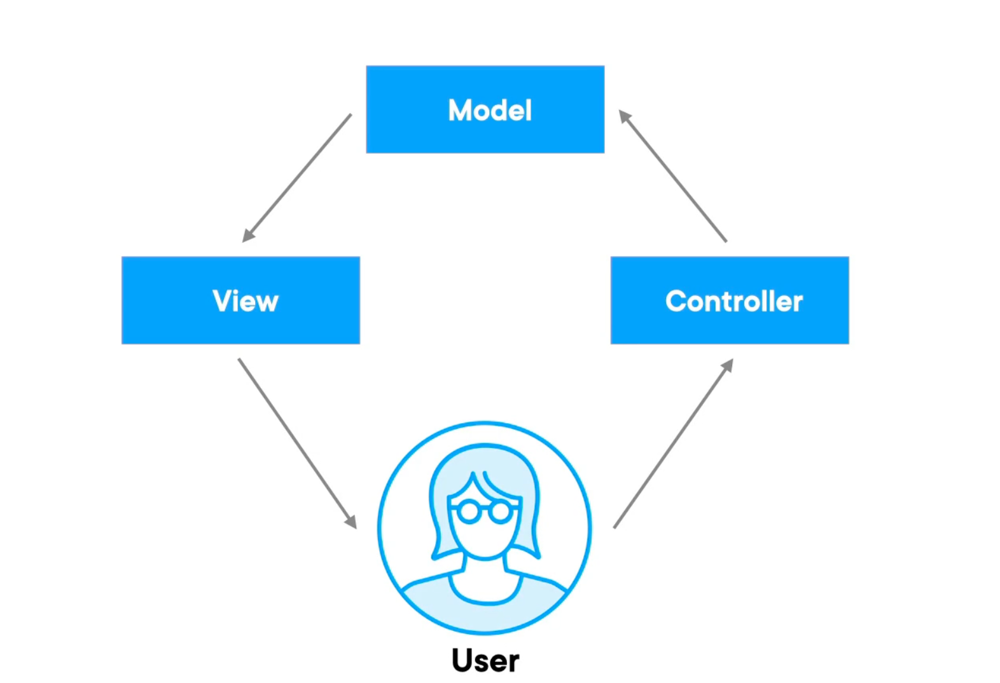

# Model View Controller 

---

## The Model-View-Controller (MVC) pattern is a software architectural pattern for implementing user interfaces on computers. It divides a given application into three interconnected parts:

- Above shows the MVC pattern arthitecture that is fallowed throughout the use of MVC.
- The Model-View-Controller (MVC) pattern is a software architectural pattern for implementing user interfaces on computers. It divides a given application into three interconnected parts:
- **Model**: The model is the part of the application that handles the data and business logic. It represents the application's state and provides methods to manipulate that state. The model is responsible for retrieving data from the database, processing it, and returning it to the controller.
- **View**: The view is the part of the application that displays the data to the user. It is responsible for rendering the user interface and presenting the data in a way that is easy to understand. The view receives data from the model and displays it to the user.
- **Controller**: The controller is the part of the application that handles user input and interacts with the model and view. It receives input from the user, processes it, and updates the model and view accordingly. The controller acts as an intermediary between the model and view, ensuring that they work together seamlessly.
- The MVC pattern promotes separation of concerns, making it easier to manage and maintain the application. By separating the application into three distinct components, developers can work on each part independently, leading to better organization and code quality.
- The MVC pattern is widely used in web development frameworks, such as Spring MVC, Ruby on Rails, and ASP.NET MVC. It provides a clear structure for building applications and allows for easy scalability and maintainability.
- The MVC pattern is widely used in web development frameworks, such as Spring MVC, Ruby on Rails, and ASP.NET MVC. It provides a clear structure for building applications and allows for easy scalability and maintainability.
- The Easy practical versions of these are as fallows:
  - The `View` can be as simple as a reservation service interface
    - Compiling JSP's and work with various 3rd party templating tools and frameworks
  - The `Controller` remains the same regardless of the view technology(frontend/backend) and is usually written in Spring beans & configured in Spring beans
- Note: All of this can be configured without any XML configuration, using Java annotations and Spring Boot.
